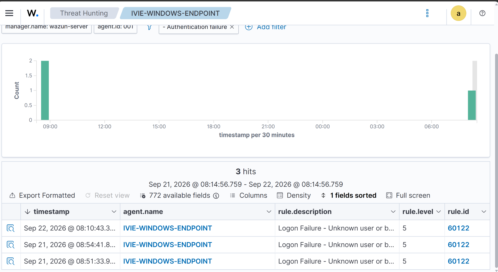
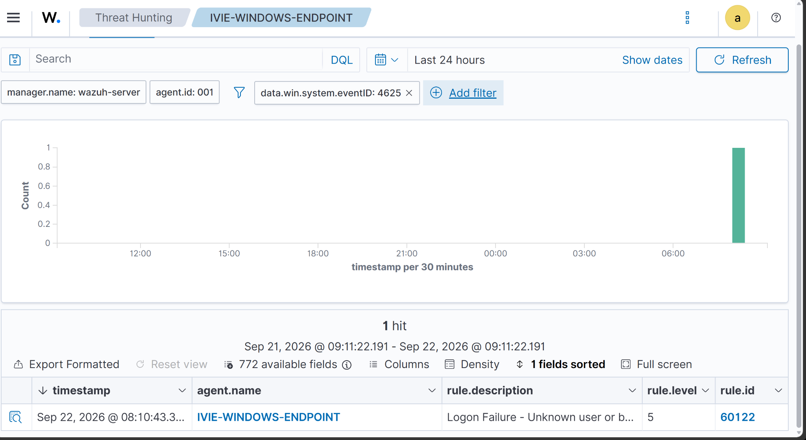
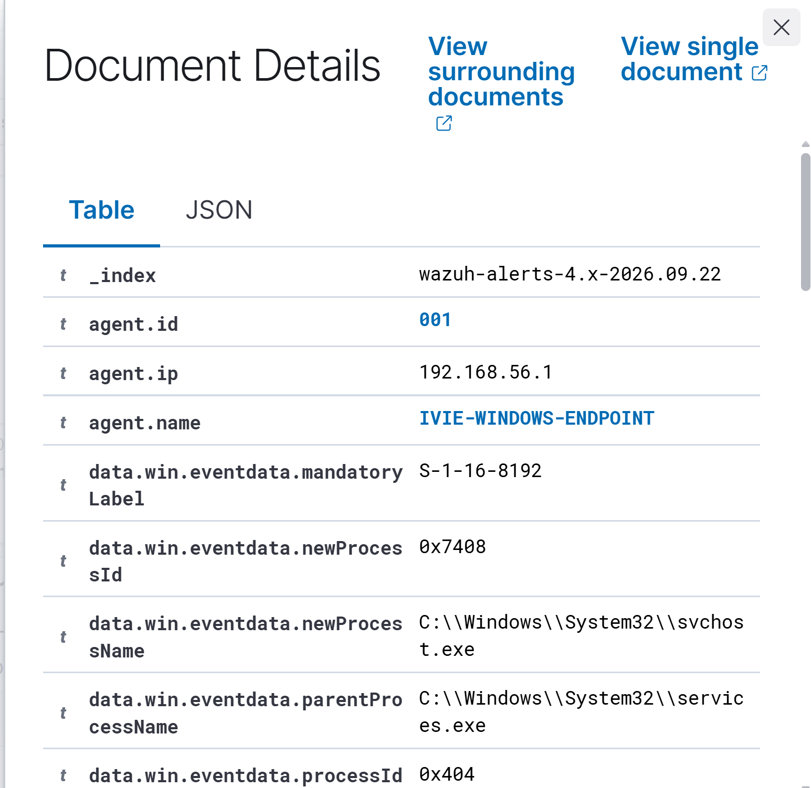
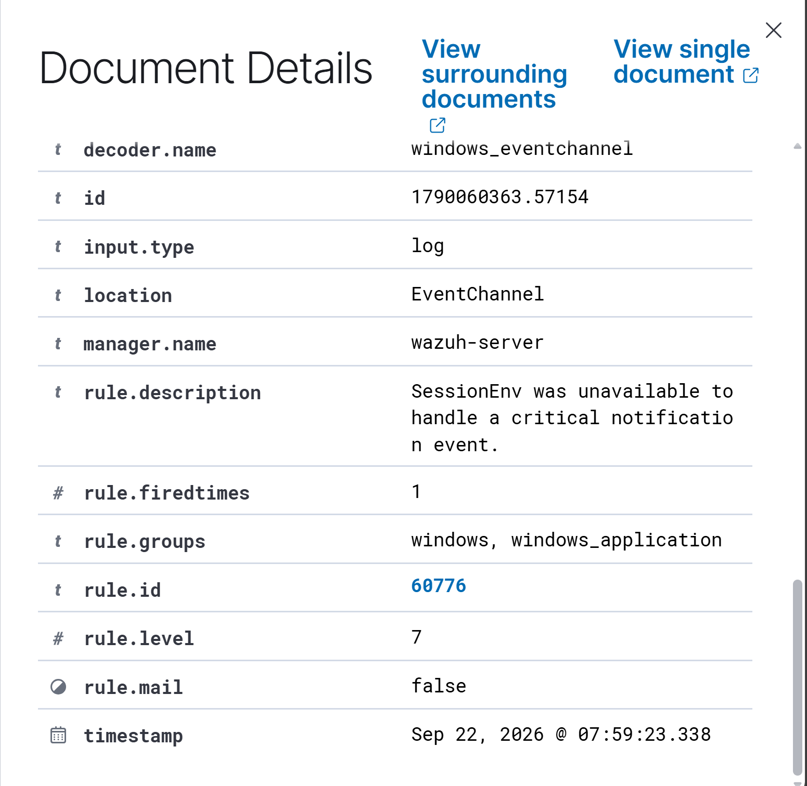

# 🛡️ Windows Endpoint Security Monitoring & Threat Hunting with Wazuh

## 📌 Project Overview

This project documents a hands-on SOC investigation performed using Wazuh SIEM to monitor and investigate security events generated by a Windows endpoint.

The objective was to practice the workflow of a SOC analyst by reviewing security alerts, filtering large volumes of endpoint telemetry, investigating failed authentication events, analyzing process creation activity, correlating Windows Event Logs, and determining whether observed alerts represented malicious or benign activity.

The investigation demonstrated an important SOC principle: an alert is an indication that requires investigation — not automatic proof of compromise.

---

## 🎯 Objectives

- Monitor a Windows endpoint using Wazuh SIEM
- Perform threat hunting across Windows security telemetry
- Investigate authentication failures
- Analyze Windows Event ID 4625
- Review process creation activity
- Investigate higher-severity Wazuh alerts
- Correlate multiple events before determining severity
- Distinguish suspicious activity from likely benign system/application behaviour
- Document findings using a SOC-style investigation workflow

---

## 🧪 Lab Environment

| Component | Configuration |
|---|---|
| SIEM | Wazuh |
| Monitored Endpoint | Windows 11 |
| Wazuh Agent | IVIE-WINDOWS-ENDPOINT (Agent 001) |
| Attacker/Test Machine | Kali Linux |
| Virtualization | Oracle VirtualBox |
| Network | Isolated lab / Host-Only network |
| Primary Log Sources | Windows Security and Application Event Logs |

---

## 🔎 Investigation Workflow

The investigation followed a structured SOC workflow:

**Alert Identification → Triage → Event Analysis → Process Investigation → Correlation → Assessment → Documentation**

Wazuh Threat Hunting was used to filter endpoint telemetry and investigate individual Windows events.

---

## 🚨 Finding 1 — Authentication Failure Investigation

Wazuh identified multiple authentication failure events on the monitored Windows endpoint.

The events were investigated using Windows Event ID **4625 — An account failed to log on**.

### Key Event Details

| Field | Observed Value |
|---|---|
| Windows Event ID | 4625 |
| Logon Type | 4 |
| Target Account | SYSTEM |
| Failure Reason | Unknown user name or bad password |
| Status | 0xC000006D |
| Sub Status | 0xC0000064 |
| Workstation | IVIES |
| Wazuh Rule ID | 60122 |
| Wazuh Rule Level | 5 |

Further investigation identified the caller process as:

`C:\Program Files\Dell\SupportAssistAgent\PCDr\SupportAssist\6.0.7033.2285\pcdrsysinfosoftware.p5x`

The reviewed event did not contain a remote source network address or source port.

### Analyst Assessment

The available evidence did not support classifying these authentication failures as a remote brute-force attack.

The events were associated with a local Dell SupportAssist component attempting a batch-type authentication using the SYSTEM account.

This activity was therefore assessed as **likely benign/application-related authentication failure**, with continued monitoring recommended.

---

## ⚙️ Finding 2 — Process Creation Analysis

Wazuh process telemetry was reviewed using events with the description:

**A process was created.**

A reviewed process event showed:

- New process: `C:\Windows\System32\svchost.exe`
- Parent process: `C:\Windows\System32\services.exe`
- Wazuh Rule ID: `67027`
- Rule Level: `3`

The parent-child process relationship was examined for suspicious behaviour.

Based on the available telemetry, the reviewed event did not independently indicate malicious process execution.

---

## ⚠️ Finding 3 — Higher-Severity Alert Investigation

Threat hunting was performed for Wazuh alerts with a rule level of **7 or higher**.

One alert was identified and investigated.

### Alert Details

| Field | Value |
|---|---|
| Windows Event ID | 6003 |
| Wazuh Rule ID | 60776 |
| Rule Level | 7 |
| Rule Group | windows, windows_application |
| Fired Times | 1 |
| Decoder | windows_eventchannel |

Wazuh reported:

> **SessionEnv was unavailable to handle a critical notification event.**

The alert was investigated because of its higher Wazuh severity level.

However, the available evidence did not show a malicious executable, successful unauthorized authentication, attacker-controlled source, or other corroborating indicators of compromise associated with the event.

---

## 🧠 SOC Analyst Conclusion

The investigation demonstrated why security alerts must be validated before escalation.

Authentication failures initially appeared potentially suspicious, but event-level analysis revealed local application context associated with Dell SupportAssist.

A separate Level 7 Wazuh alert was also investigated, but the available evidence did not establish malicious activity or endpoint compromise.

### Final Disposition

**No confirmed compromise identified from the investigated events.**

The events were documented and assessed with continued monitoring recommended.

---

## 🛠️ Skills Demonstrated

- Wazuh SIEM
- Threat Hunting
- Windows Event Log Analysis
- Alert Triage
- Windows Event ID 4625 Analysis
- Authentication Failure Investigation
- Process Creation Analysis
- Parent/Child Process Correlation
- Event Filtering
- Alert Severity Analysis
- False Positive / Benign Activity Assessment
- Incident Documentation
- SOC Investigation Workflow

---

## 📸 Investigation Evidence

Screenshots from the Wazuh investigation will be included below to demonstrate the alert triage, event analysis, and investigation workflow.

### Authentication Failure Investigation

### Windows Event 4625 Analysis

### Process Creation Analysis

### Level 7 Alert Investigation

---

## 📚 Key Takeaway

A SOC analyst should not assume that every security alert represents an attack.

Effective investigation requires examining the underlying event data, process context, authentication information, severity, and supporting evidence before determining whether escalation is necessary.

---

## 👩🏽‍💻 Analyst

**Ivie Wilson**

Cybersecurity | SOC Analysis | Cloud Security
## Investigation Evidence
